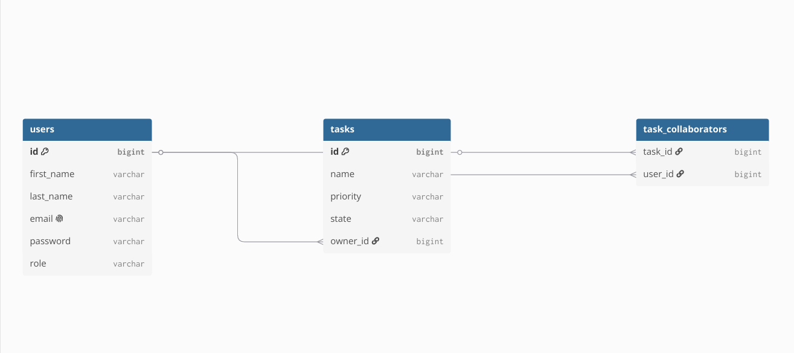

# ToDo Task App ✅

Welcome to the ToDo Task project! This is a full-stack task management application where users can create their own tasks, share them with collaborators, and admins can manage users and roles

## Table of Contents

- [Technologies Used](#technologies-used)
- [User Roles](#user-roles)
- [Actions](#actions)
- [Database Schema](#database-schema)
- [Project Structure](#project-structure)
- [Running the Project 🚀](#running-the-project)
- [Testing](#testing)

## Technologies Used

**Backend 💡**

- Java 21
- Spring Boot 4
- Spring Modulith
- Spring Security (JWT)
- Spring Data JPA
- PostgreSQL
- MapStruct
- Lombok
- Maven
- Checkstyle

**Frontend 💡**

- React
- TypeScript
- Vite
- React Router

## User Roles

1. User 👤: Can manage their own tasks, collaborate on shared tasks, and edit their own profile
2. Admin 🧑‍💻: Can do everything a user can and change user roles

## Actions

### For User 👤

| Action | Description |
| --- | --- |
| Register and Sign in: | Create an account and sign in to access the app |
| Manage Tasks: | Create, view, edit, and delete own tasks |
| Collaborate: | Be added to tasks as a collaborator and edit shared tasks |
| Edit Profile: | Update own name, email, and optionally the password |

### For Admin 🧑‍💻

| Action | Description |
| --- | --- |
| Manage Roles: | Change a user's role |
| Manage Users: | Delete users |

## Database Schema

## Project Structure

    backend/src/main/java/com/todotask/backend
    ├── core      (shared exceptions, security context)
    ├── user      (users, roles, registration)
    ├── task      (tasks, collaborators, access rules)
    └── security  (JWT authentication, login)

    frontend/src
    ├── api       (HTTP client and API calls)
    ├── components
    ├── pages
    └── types

The backend is built as a Spring Modulith application — modules are isolated and communicate only through public APIs and domain events

## Running the Project 🚀

### Prerequisites

- Java 21
- Node.js and pnpm
- Docker

### Backend

1. Start the PostgreSQL database from the project root:

       docker compose up -d
       docker ps

2. Run the backend (profile `prod`) from IntelliJ IDEA, or with Maven:

       cd backend
       ./mvnw spring-boot:run "-Dspring-boot.run.profiles=prod"

   The backend runs on `http://localhost:8080`

### Frontend

    cd frontend
    pnpm install
    pnpm dev

The frontend runs on `http://localhost:5173`

## Testing

Run the backend tests and the Checkstyle check:

    cd backend
    ./mvnw clean test
    ./mvnw checkstyle:check
